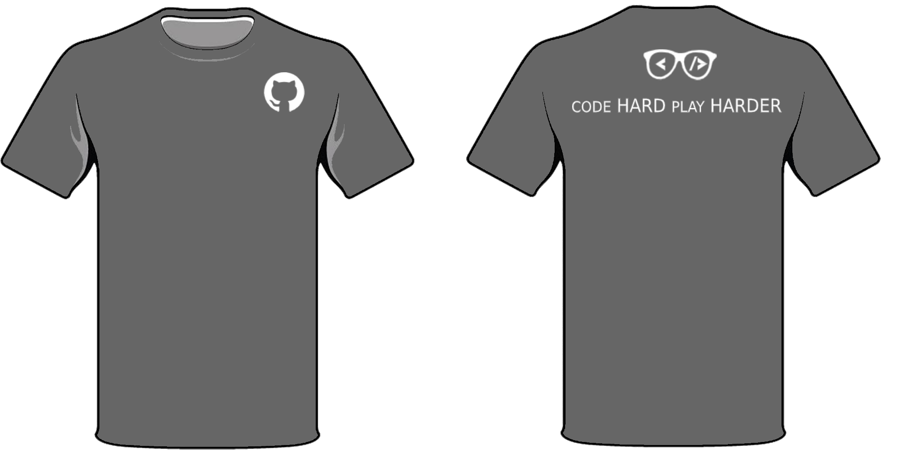
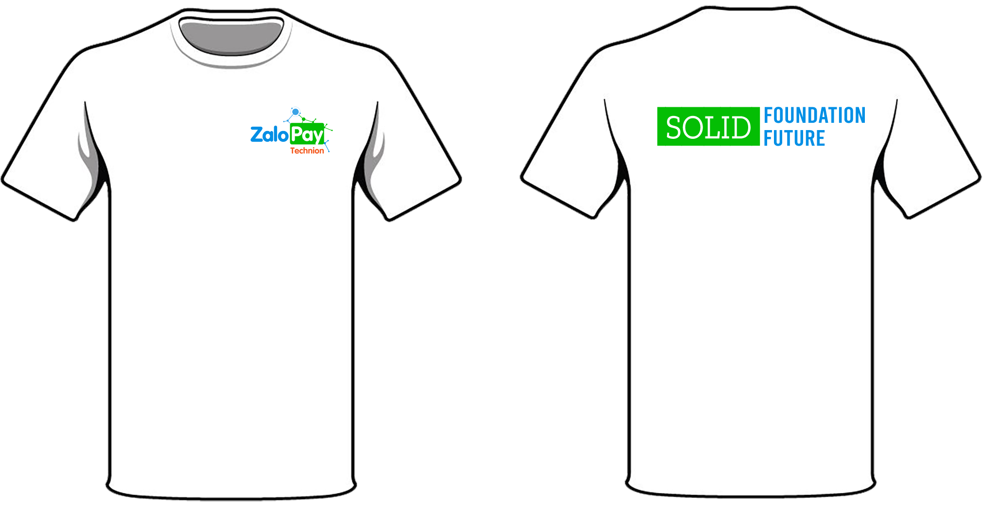
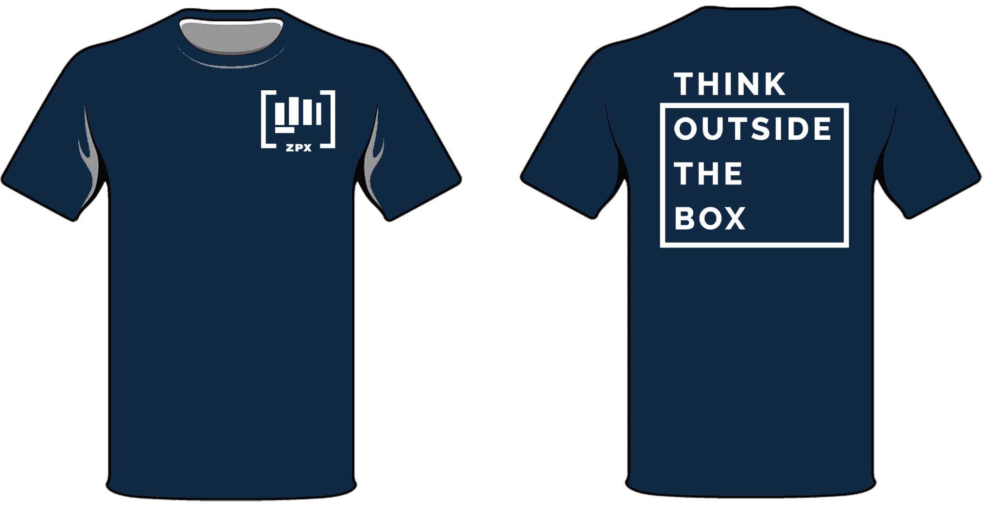

# Project T-shirt
- [Project T-shirt](#project-t-shirt)
  - [Giới thiệu](#gi%e1%bb%9bi-thi%e1%bb%87u)
  - [Design T-shirt](#design-t-shirt)
    - [01/2019](#012019)
    - [09/2019](#092019)
    - [03/2020](#032020)
## Giới thiệu
Sự gắn kết giữa các thành viên với nhau do nhiều yếu tố tạo thành. Khi đi cùng nhau, mang trên mình chiếc áo team sẽ dễ dàng nhận ra hơn rất nhiều so với khi không mặc.

## Design T-shirt
Chúng mình đã tổng hợp các mẫu thiết kế áo ở các mốc thời gian dưới đây.

### 01/2019

  
   

  

  

Logo trước ngực hình nắm tay đang đưa về phía trước như thể hiện sự đoàn kết giữa các thành viên và nhiệt huyết của tuổi trẻ. Với slogan  **"Think outside the box"** có nghĩa nhắc chúng ta nên suy nghĩ một cách sáng tạo, mới mẻ, đột phá, không theo quy lề lối cũ. Đặc biệt trong ngành công nghệ thông tin thì việc sáng tạo và không ngừng thay đổi là yếu tố không thể thiếu.